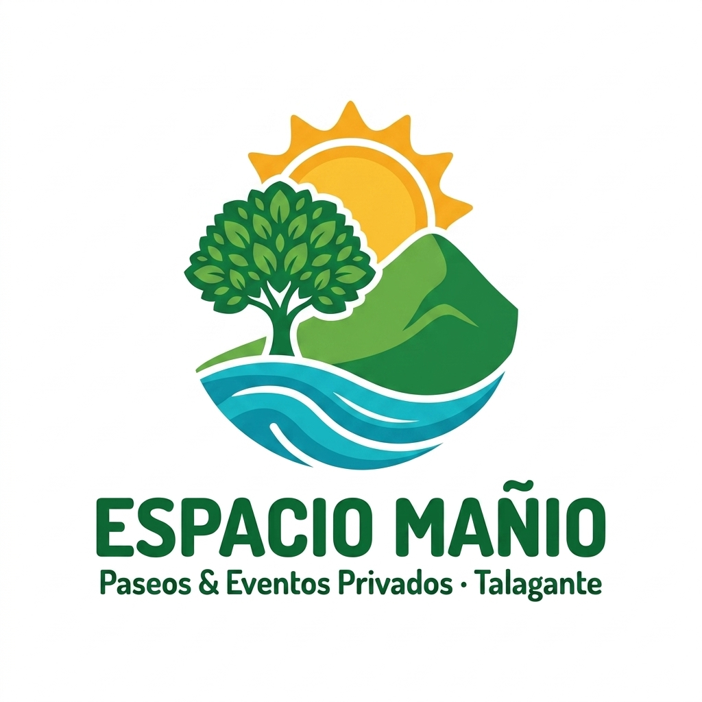

# 🌳 Espacio Mañio — Paseos & Eventos Privados (Talagante)

Sitio web oficial, identidad corporativa y sistema de cotización de disponibilidad para **Espacio Mañio**, exclusiva parcela para eventos y descanso ubicados en **Lonquén Sur, Paradero 38 1/2, Comuna de Talagante**.



---

## 🌟 Características Principales

* 🏊‍♂️ **Espectacular Piscina de 15x7 metros**: Agua cristalina con solárium y reposeras de madera.
* 🥩 **Quincho Equipado**: Pérgola techada con parrilla para asados y mesas.
* 🌳 **Amplias Áreas Verdes**: Extensos sectores de césped y arbolado nativo para juegos y descanso.
* 🚗 **Gran Estacionamiento Privado**: Amplio recinto cerrado para múltiples vehículos.
* 🚻 **Baños e Instalaciones**: Servicios sanitarios higienizados.
* 🔒 **Eventos 100% Privados**: Exclusividad total para el grupo durante la jornada.

---

## 📱 Módulo de Cotización & Integración WhatsApp

El sitio web incluye un motor de cotización interactivo en el cual el visitante elige:
1. **Fecha solicitada** (con validación de fecha mínima).
2. **Tipo de evento** (Paseo de día, Cumpleaños, Evento empresa, Reunión familiar).
3. **Cantidad de asistentes** (1-20, 21-40, 41-70, +70 personas).
4. **Nombre y comentarios**.

Al hacer clic en **"Consultar por WhatsApp"**, se genera automáticamente una URL enviando un mensaje estructurado directamente a los números oficiales:
* 🟢 **WhatsApp Principal**: `+56 9 2905 5258`
* 🟢 **WhatsApp Secundario**: `+56 9 8888 6174`
* 📷 **Instagram**: `@espaciomanio`

---

## 📁 Estructura del Proyecto

```text
Proyecto Parcela/
├── index.html                           # Estructura HTML5 responsiva y semántica
├── styles.css                           # Sistema de diseño, Glassmorphism y CSS Variables
├── app.js                               # Lógica JS de calendario, modal y WhatsApp API
├── README.md                            # Documentación completa del proyecto
├── .gitignore                           # Exclusiones de archivos temporales
├── afiche_oficial_espacio_manio.png     # Afiche promocional oficial
├── logo_horizontal_espanol.png          # Logo corporativo horizontal
├── logo_vertical_espanol.png            # Logo corporativo vertical/emblema
├── Certificado de Contribuciones-Parcela 13.pdf # Documento tributario SII
└── Fotos Parcela/                       # 41 Fotos y Videos reales del recinto
```

---

## 🚀 Publicación en GitHub Pages / Hosting

Para publicar esta página en internet mediante **GitHub Pages**:

1. Crear un repositorio público en GitHub llamado `espacio-manio`.
2. Ejecutar en la terminal desde esta carpeta:
   ```bash
   git init
   git add .
   git commit -m "Initial commit - Espacio Mañio Web & Branding"
   git branch -M main
   git remote add origin https://github.com/TU_USUARIO/espacio-manio.git
   git push -u origin main
   ```
3. Ir a **Settings > Pages** en GitHub y seleccionar la rama `main`.
4. ¡Listo! Tu página quedará en vivo en `https://TU_USUARIO.github.io/espacio-manio/`.

---

## 📍 Ubicación

* **Dirección**: Lonquén Sur, Paradero 38 1/2, Talagante, Región Metropolitana, Chile.
* **Redes**: Instagram `@espaciomanio`
